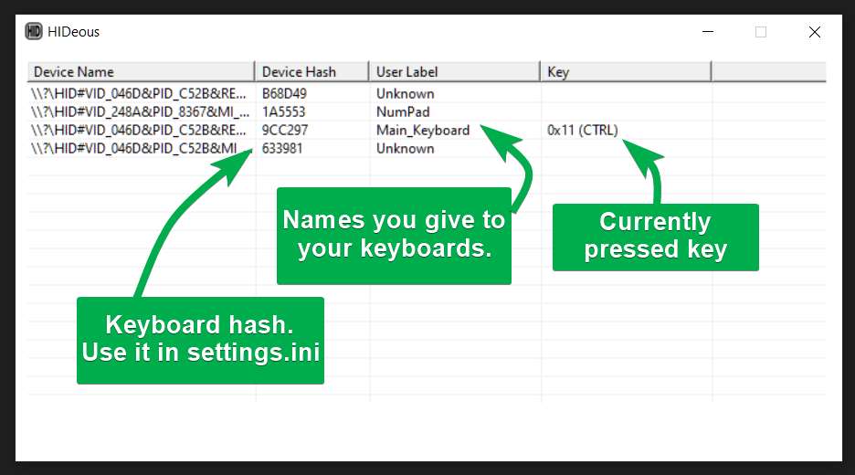

# HIDeous: Turn every keyboard into a macro pad

HID = [Human Interface Device](https://en.wikipedia.org/wiki/USB_human_interface_device_class)

Free Windows app that allows the keyboard lying in your drawer to be useful again.

- [Features](#features)
- [UI](#ui)
- [Usage](#usage)
- [Settings](#settings)
- [Profiles](#profiles)
- [Key names](#key-names)
- [Similar Tools](#similar-tools)
- [Troubleshooting & Support](#troubleshooting--support)
- [Disclaimer](#disclaimer)
- [License](#license)

## Features

- **Key -> Combo**: Press a single key to send a combo like `Ctrl+C`.
- **Key -> Text**: Press a single key to send a text like `¯\_(ツ)_/¯`. Supports control keys like `{ENTER}`!
- **Key -> Run**: Press a single key to run a command like `explorer.exe C:\Some\Path`.
- **Profiles**: Switch between different sets of key bindings easily.
- **Any USB keyboard**: No matter how old or cheap.
- **Unicode support**: Emoji, math symbols, katakana? No problem.
- **No drivers required**: Just run the `.exe`.
- **Portable**: No installation required.
- **Minimal UI**: Just the essentials.
- **Configuration in `.ini`**: Simple format, set and forget.

(Granted, the last two features can be viewed as _lack of features_ by the "glass half empty" folks, but I like to think of them as _simplicity_.)

## UI



## Usage

0. Plug in a second (third, fourth, etc.) keyboard.
1. Download the latest release from [Releases](https://github.com/dero/HIDeous/releases) and extract it.
2. Run `HIDeous.exe`.
3. Press a key, a key code will appear in one of the rows.
4. Note down the "Device Hash" of that keyboard.
5. Edit `settings.ini` in the application directory.
6. Done! 🎉 Changes are applied automatically.

## Settings

All settings are stored in `settings.ini` in the same directory as the app.

This is my actual `settings.ini` that I use at home, I just added comments to explain each section.

```ini
; ❌ Don't touch Global settings, unless something is broken.
[Global]
; When `1`, it will create `debug.log` in this directory with debug info.
; ⚠ Can be a lot of data, keep this disabled when not needed.
Debug=0

; How long to give the app to register a key, in milliseconds.
; If the app keeps missing keys, try increasing this.
KeyWaitTime=30


; ✅ Edit this section to name your keyboards.
; Left side = Any name you want to give your keyboard.
; Right side = Its Device Hash, find it in the UI.
[Devices]
Main_Keyboard=9CC297
NumPad=1A5553

; ✅ Edit this section to set bindings for a specific keyboard.
; This section configures my main keyboard.
;
; `text:` prefix will send a text. Use {KEY} for special keys, e.g. text:Hello{ENTER}World.
; `keys:` prefix will send a key combination.
; `run:` prefix will run a command.
;
; ⚠ Never include a comment in the same line as a key binding. ⚠
[Main_Keyboard]
MULTIPLY=text:×

; ✅ The same, but for my external numpad.
[NumPad]
Numpad0=keys:WIN+F10
Numpad1=keys:WIN+F1
Numpad2=keys:WIN+F2
Numpad3=keys:WIN+F3
DECIMAL=keys:WIN+F11
ENTER=keys:WIN+F12
Numpad7=keys:CTRL+SHIFT+F9
Numpad8=keys:CTRL+SHIFT+F10
Numpad9=keys:CTRL+SHIFT+F11
ADD=keys:CTRL+SHIFT+F12
MULTIPLY=text:×
Numpad4=run:explorer.exe C:\data\ShareX\Screenshots

; Switch to the `settings.Secondary.ini` profile.
ESCAPE=profile:Secondary


; That's it! Save the file and the app will reload automatically.
```

## Profiles

By default, only key bindings from the main `settings.ini` file are active.

To use a different set of key bindings, create a new `.ini` file in the same directory as the app, e.g. `settings.Secondary.ini`.

To switch to that profile, either select it from the UI or add a key binding with the `profile:` prefix, e.g. `ESCAPE=profile:Secondary`.

This allows you to have different sets of key bindings for different tasks or applications.

Example of the `settings.Secondary.ini` file:

```ini
; https://github.com/dero/HIDeous

; --------------------------------------------------------
; CHANGES TO THIS FILE ARE AUTOMATICALLY RELOADED BY THE APP
; --------------------------------------------------------

; Don't repeat the [Global] and [Devices] sections, they are always
; loaded from the main settings file.

[NumPad]
; Remap the 0 key to a key combination different from the main profile.
Numpad0=keys:CTRL+SHIFT+ALT+F1

; Switch back to the default profile.
ESCAPE=profile:Default
```


## Key Names

You can mostly just use the intuitive name of the key, like `A`, `F1`, `SHIFT`, etc. To find out key codes for more obscure keys, you can use the UI. Press a key and its code will appear in one of the rows.

And if that's not enough, you can find the [long list of key codes baked into the app in the source code](https://github.com/dero/HIDeous/blob/a438428b1621a1244db15162217f867ebe90bb40/src/common/settings.cpp#L19-L131).

## Scan Codes

Sometimes, virtual key codes (like `NUMPAD2`) change depending on the system state (e.g. NumLock). If you want to bind a specific *physical key* regardless of what the system thinks it is, you can use **Scan Codes**.

The syntax is `SC<decimal_number>`, for example `SC80`.

**How to find a Scan Code:**
1. Open the HIDeous UI.
2. Press the key you want to map.
3. Look at the **Scan Code** column in the device list (e.g., `SC80 (0x50)`).
4. Use the `SC80` part in your `settings.ini`.

**Example:**
```ini
; This will trigger on the physical "2" key on the Numpad, 
; regardless of whether NumLock is ON (Numpad2) or OFF (ArrowDown).
SC80=text:Hello World
```

You can also use scan codes on the right side of the binding:
```ini
; Pressing F1 will simulate pressing the Enter key (Scan Code 28)
F1=keys:SC28
```

## Similar Tools

How's this different from AutoHotkey or HIDMacros?

It can tell apart individual keyboards. [AHK](https://www.autohotkey.com/) can't easily do that.

It can print Unicode strings, which is something [HIDMacros](https://www.hidmacros.eu/) struggles with.

Then there's [LuaMacros](https://www.hidmacros.eu/download.php), which is a great tool, but it can be a bit hard to wrap your head around.

And it's newer, lighter and simpler than all of them. ⚖

## Known Issues
- **Rapid Toggle Key Usage**: If you map a text macro to a toggle key (CAPSLOCK, NUMLOCK, SCROLLLOCK) and press it very rapidly, the toggle state might get out of sync (staying ON or OFF incorrectly) due to timing conditions. This is a known limitation.

## Troubleshooting & Support

Try running the app as an administrator.

If that doesn't help, it'd be great if you took the time to [create an issue on GitHub](https://github.com/dero/HIDeous/issues). I'll do my best to help you out and you'll be helping make the app better for everyone.

## Uninstall

Make sure the "Run on startup" toggle in the UI is off, then just delete the app directory.

## Disclaimer

This is essentially a keylogger. It doesn't do any shenanigans with your data, but thanks to access to your system, it could. Same as any other software you download from the internet.

If you can read and compile C++, you can check the source code and produce the binaries yourself. If you can't, either trust me or don't use this.

Also, I'm actually a web engineer, not a C++ developer by trade, so the code might be a bit rough around the edges. Constructive criticism is welcome. 🙇‍♂️


## Development

Want to build it yourself? Check out [CONTRIBUTING.md](./CONTRIBUTING.md) for build instructions.

## License

Do whatever you want with this. [MIT License](./LICENSE).

Attribution and nice words are appreciated, but not required. 🙂
